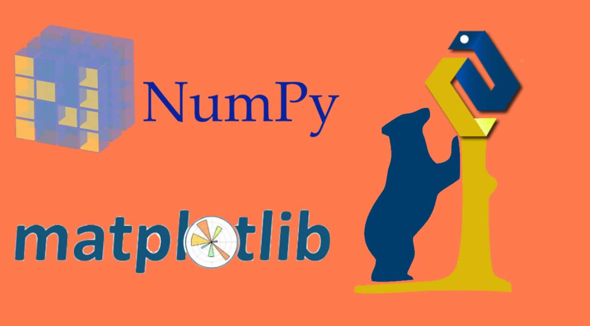

# Python-Project
ITVEDANT PROJECT OF PYTHON MODULE

This Project is Bascially made for the purpose of taking the BUSINESS DECISSION.

This Project Covers all the Topics of Python for Data Science
1. Introduction to Python
2. Variable and Data Types
3. Python Operators and Conditional Statements
4. Loops
5. Functions
6. Modules
7. OOP(Object Oriented Programming)
8. Exception Handling
9. Regex and Web Scraping
10. File Opeartion
11. Numpy
12. Pandas
13. Visualization

   [Google Colab](https://colab.research.google.com/drive/1F5npok6i_Ht3QO-MuuVjRjAkD52GzCAh?usp=sharing)
   
   [Google Slides](http://github.com)
